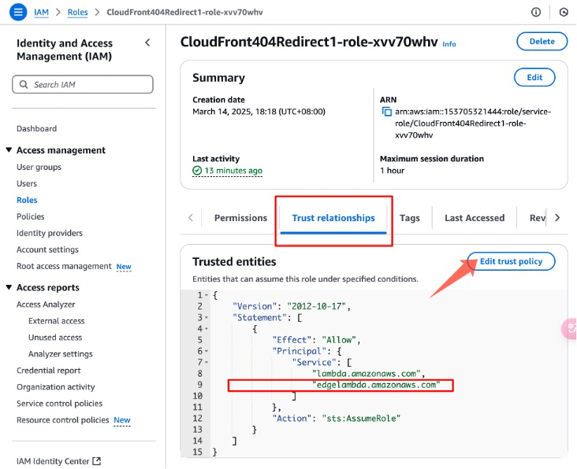
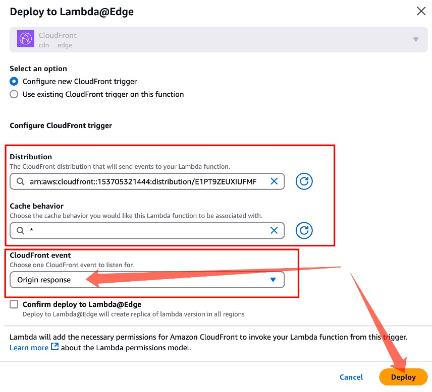
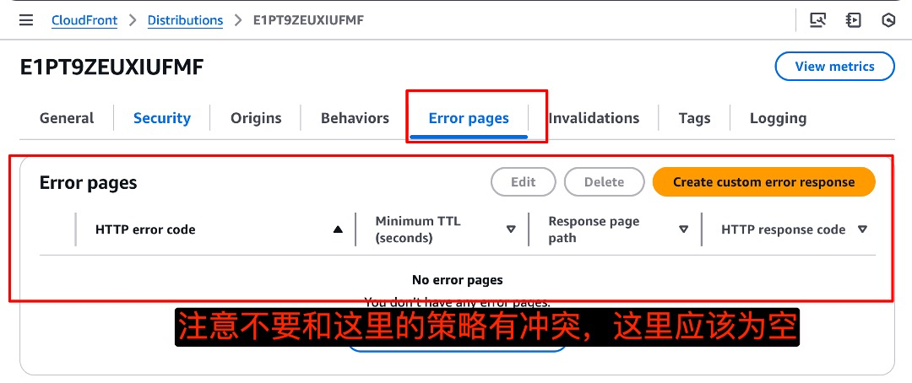

# **CDN上实现404自动重定向到/index.html，实现操作说明：AWS CloudFront 404自动重定向到/index解决方案（提供图文并茂的操作步骤，按图操作即可完成）**

本文档提供了一个详细的解决方案，用于实现AWS CloudFront分配中所有404错误自动重定向到/index.php页面。该解决方案使用Lambda@Edge功能来拦截404响应，并将其转换为302重定向。

## **前提：为了确保实现效果，建议先搭建了一个POC环境来验证，**

**您可以直接访问POC环境<https://d31fjwnior96qp.cloudfront.net/> 进行功能验证：**

1.  打开浏览器，访问一个不存在的页面，如： https://d31fjwnior96qp.cloudfront.net/test123

2.  观察浏览器地址栏，您应该会被自动重定向到： https://d31fjwnior96qp.cloudfront.net/index.php

3.  您可以尝试多个不同的路径，例如：

    - https://d31fjwnior96qp.cloudfront.net/missing.html

    - https://d31fjwnior96qp.cloudfront.net/folder/not-here.jpg

4.  无论访问哪个不存在的资源，都应该被重定向到/index.php


## **解决方案架构**

工作原理：

1.  用户请求CloudFront分配上不存在的资源，生成404错误响应

2.  Lambda@Edge函数拦截此404响应

3.  函数将404响应转换为302重定向，指向/index.php

4.  用户浏览器接收重定向响应并自动导航到/index.php页面

## **详细实施步骤**

### **前提条件**

- 已有AWS账户，并已登录AWS管理控制台

- 已创建CloudFront分配，用于分发内容

- 拥有创建Lambda函数、编辑IAM角色权限的用户

- 基本了解CloudFront和Lambda服务

### **步骤一：创建Lambda函数**

1.  登录AWS管理控制台，确保区域设置为**US East (N. Virginia) / 美国东部(弗吉尼亚北部)**地区（us-east-1）

> 注意：Lambda@Edge函数必须创建在us-east-1区域

2.  在搜索栏中搜索并点击 **Lambda** 服务

3.  点击 **创建函数** 按钮

4.  选择 **从头开始创作**，并填写以下信息：

    - **函数名称**：CloudFront404Redirect（或您喜欢的任何名称）

    - **运行时**：选择 Node.js 18.x（或当前可用的Node.js最新版本）

    - **架构**：x86_64

    - 保留其他默认设置

5.  点击 **创建函数** 按钮

6.  在代码编辑器中，将以下代码复制粘贴到index.js中：

``` python
exports.handler = async (event, context) =\> {  
 const response = event.Records\[0\].cf.response;  

 if (response.status === '404') {  
     response.status = '302';  
     response.statusDescription = 'Found';  
       
     if (response.headers\['location'\]) {  
         delete response.headers.location;  
    }  
       
     response.headers.location = \[{  
         key: 'Location',  
         value: '/index.php'  
    }\];  
}  

 return response;  
};
```
7.  点击 **部署** 按钮保存更改


### **步骤二：修改Lambda函数的IAM角色**

1.  在Lambda函数页面，在**配置**标签下，点击左侧菜单中的 **权限**

2.  在执行角色部分，点击角色名称链接（格式通常为：函数名-role-随机字符串）。这将打开IAM控制台

3.  在IAM控制台，选择 **信任关系** 标签

4.  点击 **编辑信任策略** 按钮

5.  用以下JSON替换现有策略：

``` python
{  
   "Version": "2012-10-17",  
   "Statement": \[  
      {  
           "Effect": "Allow",  
           "Principal": {  
               "Service": \[  
                   "lambda.amazonaws.com",  
                   "edgelambda.amazonaws.com"  
              \]  
          },  
           "Action": "sts:AssumeRole"  
      }  
  \]  
}
```
6.  点击 **更新策略** 按钮保存更改





### **步骤三：发布Lambda函数版本**

1.  返回Lambda函数页面

2.  点击 **操作** 下拉菜单

3.  选择 **发布新版本**

4.  在描述中输入（可选）：初始版本用于CloudFront 404重定向

5.  点击 **发布** 按钮

6.  记下发布的版本号（通常为版本1）


### **步骤四：将Lambda@Edge关联到CloudFront**

根据提供的截图指南，以下是如何将Lambda@Edge函数与CloudFront关联的详细步骤：

1.  在Lambda函数详情页面中，点击右上角的 **Actions（操作）** 按钮

2.  从下拉菜单中选择 **Deploy to Lambda@Edge（部署到Lambda@Edge）** 选项

3.  在弹出的 **Deploy to Lambda@Edge** 窗口中，配置以下选项：

    - **Select an option（选择一个选项）**：选择 **Configure new CloudFront trigger（配置新的CloudFront触发器）**

    - **Distribution（分配）**：

      - 从下拉菜单中选择或搜索您的CloudFront分配ID

      - 格式类似：arn:aws:cloudfront::1537053214xx:distribution/EXAMPLEID

    - **Cache behavior（缓存行为）**：

      - 通常选择默认值 \*，代表所有路径

      - 如需特定路径，可输入对应的路径模式

    - **CloudFront event（CloudFront事件）**：

      - 选择 **Origin response（源响应）**

      - 这是处理404错误的关键选择，在CloudFront收到源响应后但返回给客户端前触发

4.  勾选 **Confirm deploy to Lambda@Edge**（确认部署到Lambda@Edge）复选框

5.  点击右下角的 **Deploy（部署）** 按钮

6.  部署过程会自动：

    - 将Lambda函数复制到全球各个AWS区域

    - 添加必要的权限，允许CloudFront调用Lambda函数

    - 建立CloudFront分配与Lambda函数之间的关联

7.  等待CloudFront分配完成部署（这可能需要几分钟到几十分钟不等）

> 提示：CloudFront控制台中的分配状态会显示 "部署中"，当更改完全传播时会变为 "已部署"




***进入cloudfront里面看是否配置成功：***


### **步骤五：测试和验证**

1.  等待CloudFront分配状态变为 "已部署"

2.  在浏览器中，尝试访问CloudFront分配中不存在的页面，例如： https://your-distribution-id.cloudfront.net/non-existent-page

> 如果使用提供的POC环境进行测试： https://d31fjwnior96qp.cloudfront.net/non-existent-page

3.  观察浏览器是否自动重定向到： https://your-distribution-id.cloudfront.net/index.php

> 或POC环境中的： https://d31fjwnior96qp.cloudfront.net/index.php

4.  如果重定向成功，您将看到/index.php页面的内容，而不是404错误页面




### **问题排查**

如果重定向不起作用，请检查以下几点：

1.  **CloudFront部署未完成**：确保分配状态为"已部署"而不是"部署中"

2.  **Lambda@Edge函数未正确部署**：

    - 确认您选择了正确的事件触发器（原始响应）

    - 确认函数已发布版本，而不是使用\$LATEST

    - 检查CloudFront控制台中是否存在Lambda@Edge函数相关的错误

3.  **IAM权限问题**：

    - 确保Lambda函数的执行角色信任关系中包含edgelambda.amazonaws.com

4.  **查看CloudWatch日志**：

    - Lambda@Edge函数的日志存储在执行该函数的AWS区域

    - 在CloudWatch控制台，查找格式为/aws/lambda/us-east-1.函数名的日志组

## **限制与注意事项**

1.  **区域限制**：Lambda@Edge函数必须在US East (N. Virginia)区域创建

2.  **部署延迟**：Lambda@Edge与CloudFront的关联可能需要几分钟到十几分钟才能完全生效

3.  **缓存行为**：确保理解CloudFront的缓存行为，以避免意外结果

**结论**

通过本教程，您已经成功实现了CloudFront分配中404错误自动重定向到/index.php页面的功能。这种方法可以有效地处理缺少的资源请求，提供更好的用户体验，同时保持URL结构的一致性。Lambda@Edge为CloudFront提供了强大的自定义响应能力，您可以根据需要进一步扩展此功能。


## 不要担心  Lambda@Edge 函数在美国东部(us-east-1)区域创建

澄清的是：Lambda@Edge 函数需要在美国东部(us-east-1)区域创建和管理，但实际执行发生在全球 CloudFront 边缘位置。 因为代码分发和执行都是、分开的，所以函数部署在美东不是问题。

官网链接: https://docs.aws.amazon.com/AmazonCloudFront/latest/DeveloperGuide/lambda-requirements-limits.html

"You must create your Lambda functions in the US East (N. Virginia) Region (us-east-1)."
"虽然您必须在美国东部(弗吉尼亚北部)区域创建 Lambda@Edge 函数，但当您将函数与 CloudFront 分配关联后，CloudFront 会自动在全球复制您的函数至边缘位置。"

**实际上lambda函数还是会边缘部署，只是在美东注册**


结束

